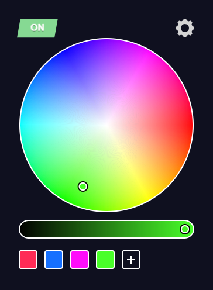

<p align="center">
  <a href="https://github.com/seravifer/led-strip-desktop-controller">
    
  </a>

  <h3 align="center">Led Controller for Desktop</h3>

  <p align="center">
    Control your LED strip/bulb from your desktop over WiFi.
    <br />
    <i>Support Flux/MagicHome protocol.</i>
    <br />
    <br />
    <a href="https://github.com/seravifer/led-strip-desktop-controller/issues">Report Bug</a>
    ·
    <a href="https://github.com/seravifer/led-strip-desktop-controller/issues">Request Feature</a>
  </p>
</p>

## About The Project
<p align="center">
  
</p>

## Development
### Installation
```
  $ npm ci
```

### Run
```
  $ npm start react
```
In another window
```
  $ npm start electron:dev
```

### Build (only win)
```
  $ npm run build
```

## Credit

Icons by <a href="https://www.flaticon.es/autores/flat-icons" title="Flat Icons">Flat Icons</a>

## License

Distributed under the GPLv3 License. See `LICENSE` for more information.
